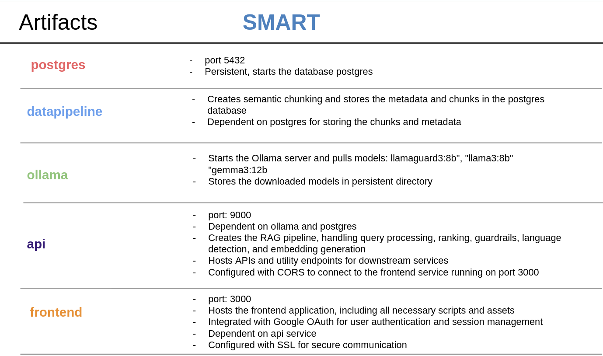
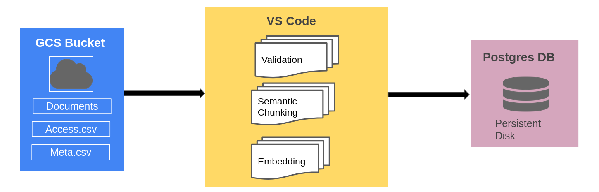
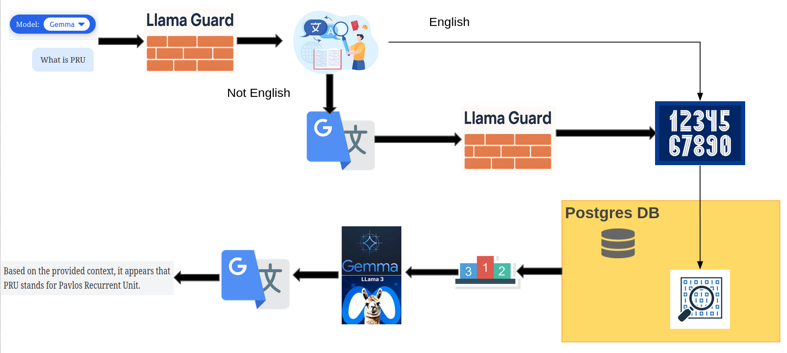
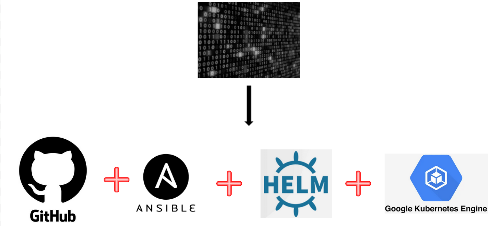
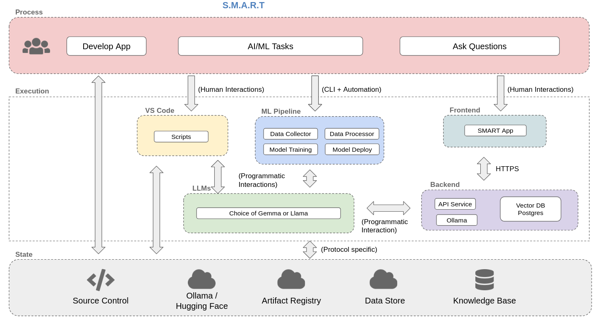
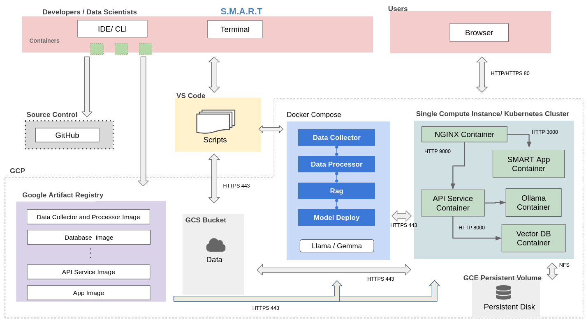

# S.M.A.R.T. — Secure ‘doc’ Management And Retrieval Technology

Organizations increasingly rely on internal digital repositories—notes, policies, records—but conventional keyword-based search fails to deliver contextual understanding. SMART addresses this gap by providing an intelligent, secure, and attribution-aware retrieval system powered by LLMs and hybrid search while prioritizing data privacy and access control.

App Link: https://smart.ghundal.com/

Presentation Link: [Presentation](./reports/MS5_SMART_Final.pptx)

SMART delivers:

- **Secure Document Storage:** Centralized, permissioned content repository (class notes, quizzes).
- **Semantic Search & Ranking:** Vector embeddings via LLM with vector and BM25 hybrid search.
- **Guardrails:** LLM powdered guardrails to avoid jailbreaking and inappropriate content.
- **LLM-Powered Summarization:** Relevant results reranked and structured via LLMs, supporting multilingual text.
- **Frontend UI:** Chatbot interface, authenticated via Google OAuth with SSL encryption.
  Security + Audit Trail: Logs at every access and retrieval point.

## **Overview**

Please reference the [Design Document](./reports/Design_Document.pdf) for full tech stack.

## **SMART Artifacts**



The following documents contain an overview of each container, its components and how to run each container.

## **Technical Components**

1. Data Pipeline


The documents, access, and metadata is stored in Google Cloud Storage bucket. The application pulls the data from the GCS bucket, performs validations to ensure that data is complete and correct, semantically chunks the data and then embeds the final chunks. The chunks along with metadata and access are stored in postgres database.

2. Application Programming Interface (API)



The user writes a query in the frontend. The query is first checked for safety by Llama Guard in the original language. If the query violates the guidelines, SMART returns the answer that the query violates the guidelines and stops the flow. If the query is safe, a voting based system detects the language of the query. If the query is in English, it is directly embedded. If the query is non English, it is translated to English and then again checked for safety by Llama Guard. Once safe, it proceeds to be embedded.

The search function prefilters the chunks based on the user access, then performs a keyword and vector search to return the most relevant documents and their metadata. That information is sent parallely to the ranker and one of the chosen LLM models (Llama3 or Gemma3) which returns an answer and the three most relevant chunks. The answer is translated back into the original language if non-English and then returned to the user in the frontend.

3. Deployment



SMART’s CI/CD (Continuous Integration/Continuous Deployment) pipeline is triggered whenever code changes are committed to GitHub. The GitHub Actions workflow runs a comprehensive suite of pre-commit checks, including linters, formatters, unit tests, and integration tests. Once all tests pass, the deployment process is initiated automatically.

Ansible scripts verify the Kubernetes cluster's status in Google Kubernetes Engine (GKE), ensuring it is ready for deployment. Helm scripts then manage the deployment within the GKE cluster, streamlining the rollout of new updates.

## **Solution Architecture**



## **Technical Architecture**



## **Local Deployment**

Refer to individual container for local deployment steps:

1. [Data Pipeline](./src/datapipeline/README.md)
2. [API](./src/api/README.md)
3. [Frontend](./src/frontend/README.md)

## **Tests**

The tests consists of:

- Linter and formatter
- Unit test for python scripts
- Unit test for Frontend
- Validation test for Frontend
- Integration tests

To run the linter locally refer:
[Linter Readme](./linters/README.md)

To run the test locally refer:
[Test Readme](./tests/README.md)

## **Production Deployment**

### Preqrequsites

- Add the secrets in th github in settings -> action

### Steps

The workflows are set up in Github actions to run on commit with following steps:

- run linters
- run tests
- build images
- push the images to GCR
  <need ansible step here>
- deploy to kubernetes

- **Commit**

```
git add .
git commit -m "<message>"
git push
```

## **Tests**
