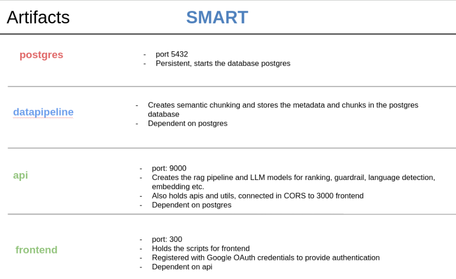
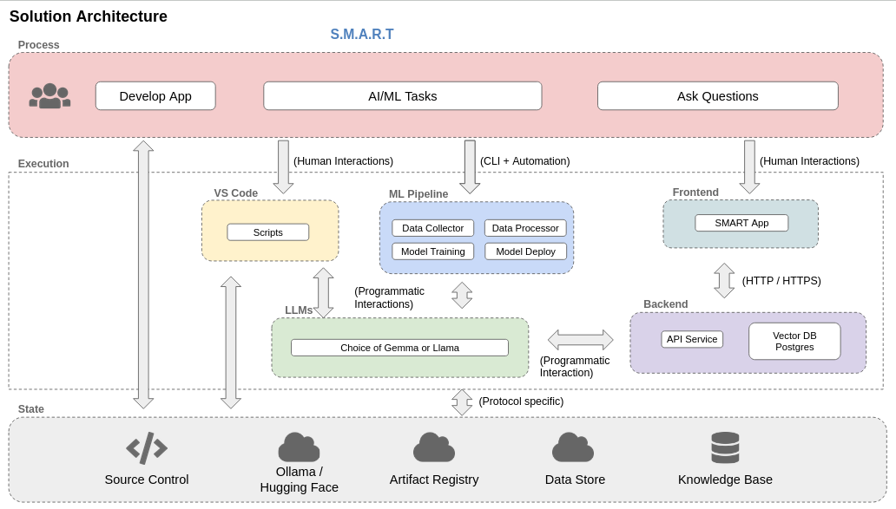
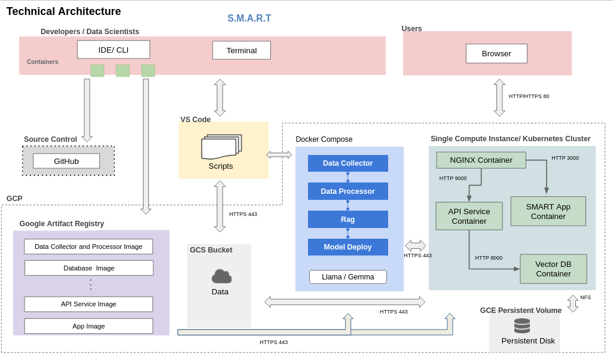
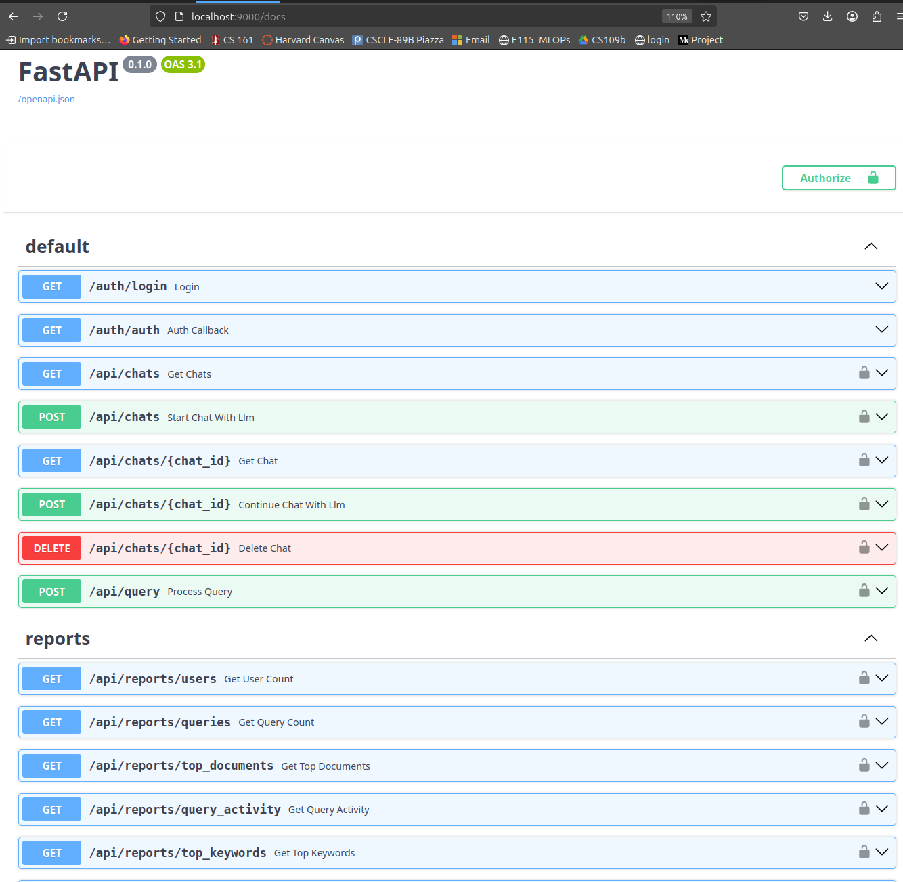
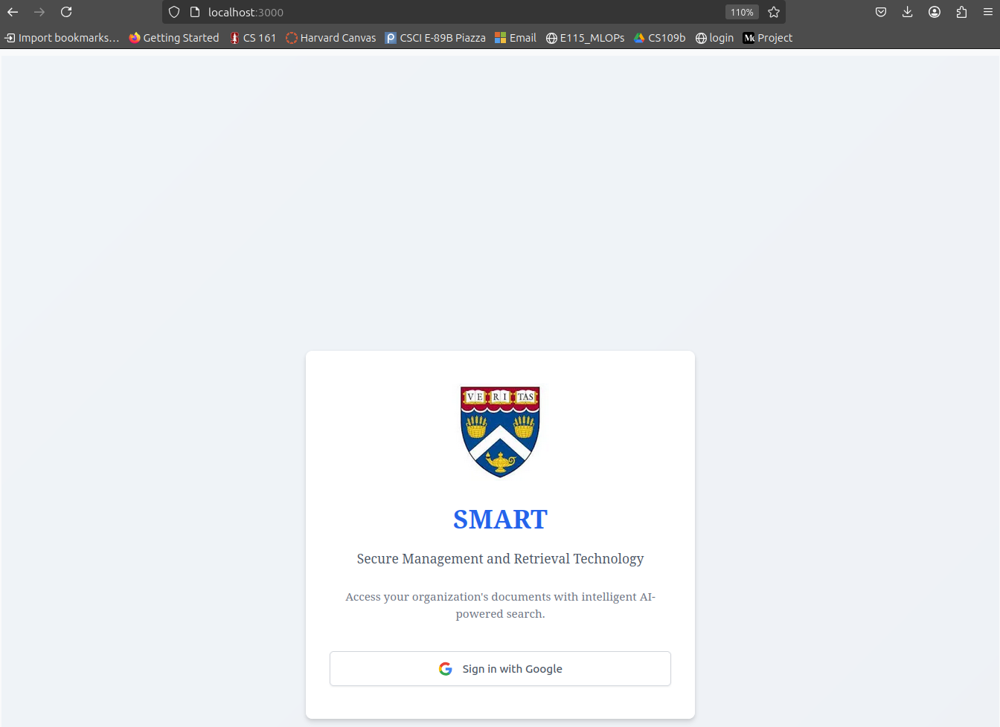
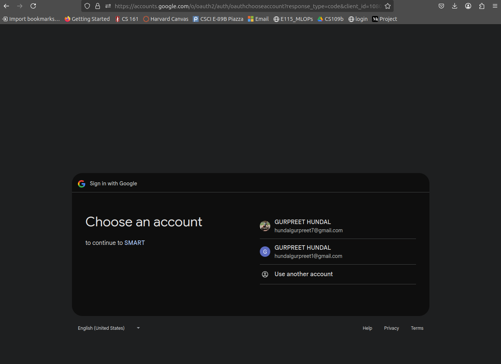
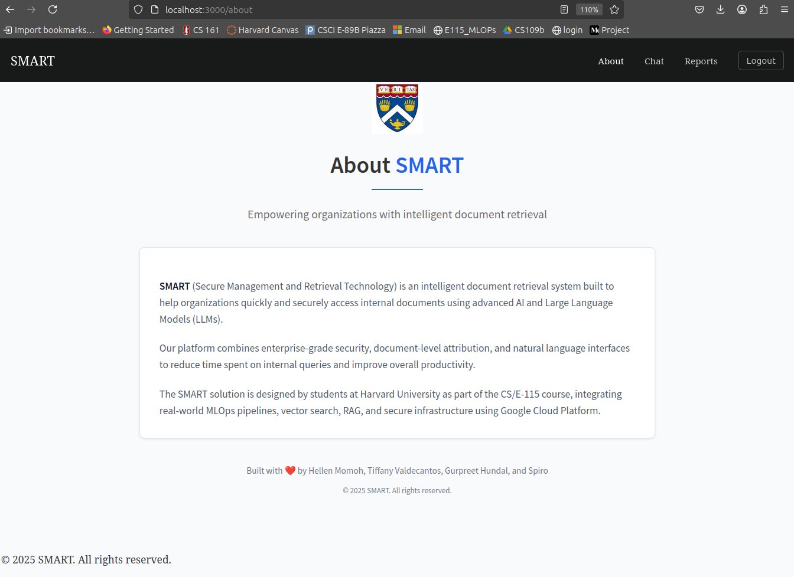
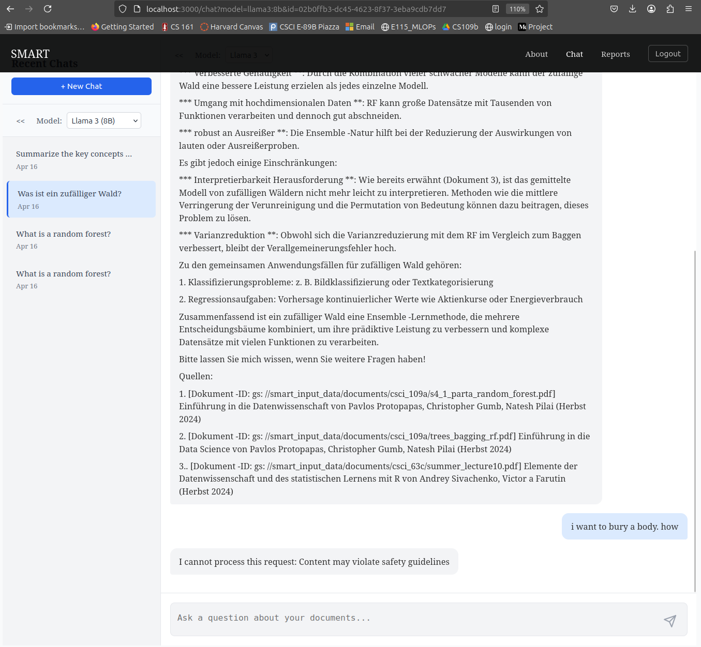
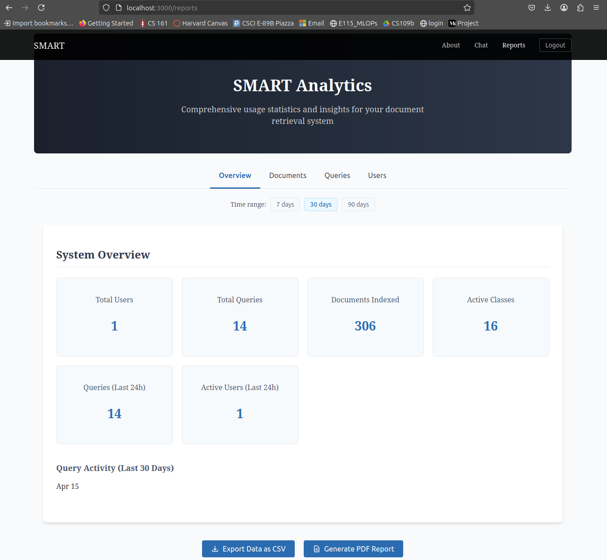

# E115_SMART Milestone 4

This repository contains a **Retrieval-Augmented Generation (RAG)** system that integrates a **vector database** with a **Large Language Model (LLM)**. 
The system:
- **Chunks** text documents
- **Embeds** the text into a vector space
- **Stores** embeddings in a **PostgreSQL + pgvector database**
- **Retrieves** relevant information using **BM25 + Vector Search**
- **Enhances** LLM responses with retrieved context

Team Members: Gurpreet K Hundal · gurpreet@sklose.com | Tiffany Valdecantos · tiv001@g.harvard.edu | Hellen Momoh · hem299@g.harvard.edu | Spiro Habasch · sph083@g.harvard.edu

## Milestone 4 Organization

```
├── Readme.md
├── reports
|      |── MS3_SMART.pdf
|      |── Design_Document.pdf
|      └── Milestone1_SMART.pdf
├── sql
│   └── init.sql
|
└── src
    ├── api
    │   ├── rag_pipeline
    |   |       |── config.py
    |   |       |── embedding.py
    |   |       |── language.py
    |   |       |── ollama_api.py
    |   |       |── safety.py
    |   |       └── search.py
    │   ├── routers
    |   |       |── auth_google.py
    |   |       |── auth_middleware.py
    |   |       |── chat_api.py
    |   |       └── reports.py    
    |   ├── utils
    |   |       |── chat_history.py
    |   |       |── database.py
    |   |       └── llm_rag_utils.py   
    |   ├── cli_main.py
    |   ├── docker_entrypoint.sh
    │   ├── Dockerfile
    │   ├── main_api.py
    │   ├── ollama.py
    │   ├── Pipfile
    │   └── Pipfile.lock
    ├── datapipeline
    │   ├── Advanced_semantic_chunker.py
    │   ├── datapipeline.py
    │   ├── docker_entrypoint.sh
    │   ├── Dockerfile
    │   ├── Pipfile
    │   └── Pipfile.lock
    ├── frontend
    │   ├── app
    |   |       |── about
    |   |       |  └── page.jsx   
    |   |       |── chat  
    |   |       |  └── page.jsx
    |   |       |── login
    |   |       |  └── page.jsx  
    |   |       |── reports
    |   |       |      └── page.jsx
    |   |       |── global.css
    |   |       |── layout.jsx
    |   |       |── not_found.jsx
    |   |       |── page.jsx
    |   |       └── page.module.css  
    │   ├── components
    |   |       |── about
    |   |       |  └── About.module.css     
    |   |       |── auth  
    |   |       |  |── LoginButton.jsx
    |   |       |  └── ProtectedRoute.jsx
    |   |       |── chat
    |   |       |  └── chat.module.css    
    |   |       |── layout
    |   |       |      |── Footer.jsx
    |   |       |      |── Footer.module.css
    |   |       |      |── Header.jsx
    |   |       |      └── Header.module.css
    |   |       └── reports 
    |   |             |── ChartCpomponent.jsx
    |   |             |── charts.module.css
    |   |             |── exportUtils.js
    |   |             └── reports.module.css  
    |   ├── context
    |   |       └── AuthContext.jsx  
    |   ├── public
    |   |       └── logo.png
    |   ├── services
    |   |       |── DataService.js
    |   |       └── ReportService.js
    │   ├── .env.local   
    │   ├── Dockerfile
    │   ├── jsconfig.json
    │   ├── package-lock.json
    │   ├── package.json
    │   └── tailwind.config.js
    ├── docker-compose.yml
    ├── docker-shell.sh
    └── Dockerfile.postgres
```

## Milestone 4 Enhancements:
- **Guardrail** Enabled guardrail to detect jailbreaking and inappropriate content
- **Multilingual** Added models to detect language and translate
- **Memory** Enabled memory for the model to continue previous chat
- **API** Added endpoints for frontend
- **Frontend** Built frontenc
- **Auth and access** Enabled GOAuth and access level prefiltering

---
## Application Design

### **Artifacts for MS4**


### **Solution Architecture**


### **Technical Architecture**


### **Backend API**


### **Frontend**

### **1. Landing Page**


### **2. Login**


### **3. Second Landing page**


### **4. Chat**


### **5. Various Reports**


## **Running the system**

### **1. Run the image smart_input to prepare the input data**
- **Loads** documents from GCP
- **Validates** to ensure that data is complete
- **Chunks** text documents using semantic chunking. Change default to recursive/semantic in main to change the chunking method. Current default = recursive. 
- **Embeds** the text into a vector space
- **Stores** embeddings in a **PostgreSQL + pgvector database**
```bash
sh docker-shell.sh datapipeline
```

### **2. Run the image api for api**

```bash
sh docker-shell.sh api
```

### **3. Run the image frontend for api**

```bash
sh docker-shell.sh frontend
```